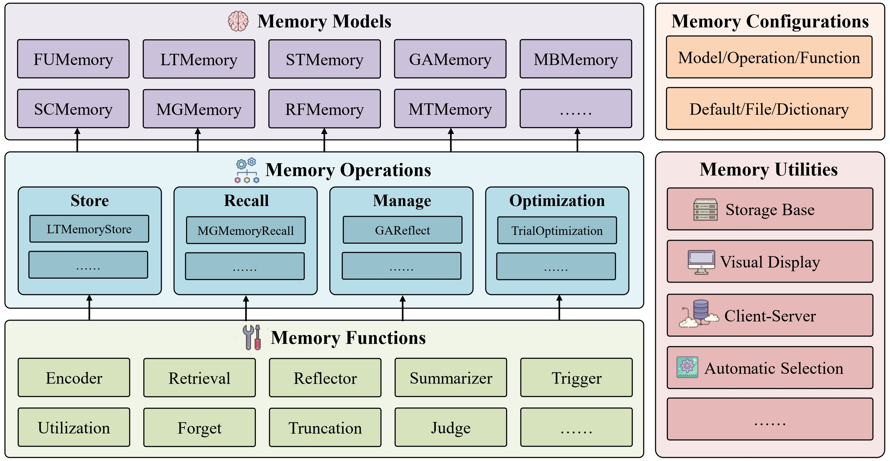

.. title:: MemEngine v1.1.0

MemEngine: A Unified and Modular Library for Developing Advanced Memory of LLM-based Agents
=============================================================================================

📝 Introduction
----------------

Recently, large language model based (LLM-based) agents have been widely applied across various fields. As a critical part, their memory capabilities have captured significant interest from both industrial and academic communities. Despite the proposal of many advanced memory models in recent research, however, there remains a lack of unified implementations under a general framework. To address this issue, we develop a unified and modular library for developing advanced memory models of LLM-based agents, called MemEngine. Based on our framework, we implement abundant memory models from recent research works.
Additionally, our library facilitates convenient and extensible memory development, and offers user-friendly and pluggable memory usage.

📌 Features
------------

**Unified and Modular Memory Framework.** We propose a unified memory framework composed of three hierarchical levels to organize and implement existing research models under a general structure. All these three levels are modularized inside our framework, where higher-level modules can reuse lower-level modules, thereby improving implementation efficiency and consistency. Besides, we provide a configuration module for easy modification of hyper-parameters and prompts at different levels, and implement a utility module to better save and demonstrate memory contents.

**Abundant Memory Implementation.** Based on our unified and modular framework, we implement a wide range of memory models from recent research works, many of which are widely applied in diverse applications. All of these models can be easily switched and tested under our framework, with different configurations of hyper-parameters and prompts that can be adjusted for better application across various agents and tasks.

**Convenient and Extensible Memory Development.** Based on our modular memory operations and memory functions, researchers can conveniently develop their own advanced memory models. They can also extend existing operations and functions to develop their own modules. To better support researchers' development, we provide detailed instructions and examples in our document to guide the customization.

**User-friendly and Pluggable Memory Usage.** Our library offers multiple deployment options, and provides various memory usage modes, including default, configurable, and automatic modes. Moreover, our memory modules are pluggable and can be easily utilized across different agent framework, which is also compatible with some prominent frameworks.

📋 Contents
------------

.. toctree::
   :maxdepth: 1
   :caption: Get Started

   get_started/installation
   get_started/deployment
   get_started/quick_start
   get_started/versions

.. toctree::
   :maxdepth: 1
   :caption: Core Modules

   modules/overview
   modules/memory_methods
   modules/memory_operations
   modules/memory_functions
   modules/memory_configs
   modules/memory_utils

.. toctree::
   :maxdepth: 1
   :caption: Development Guideline

   develop_guideline/customize_memory_methods
   develop_guideline/customize_memory_operations
   develop_guideline/customize_memory_functions

.. toctree::
   :maxdepth: 1
   :caption: API Reference

   api_reference/api_reference.rst

📧 Contact
------------
If you have any questions, please feel free to contact us via `zeyuzhang@ruc.edu.cn`.